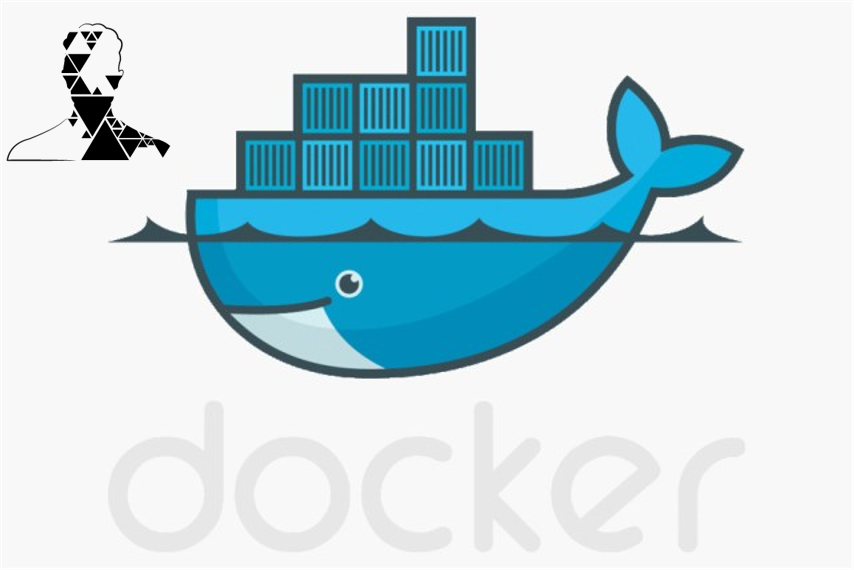

<p align="center">
  <a href="" rel="noopener">
 </a>
</p>

<h3 align="center">Noah Docker container</h3>

<div align="center">

[]()
[](/LICENSE)

</div>

---

##  Table of Contents

- [Table of Contents](#table-of-contents)
- [About <a name = "about"></a>](#about)
- [Main Features <a name = "about"></a>](#main-features)
- [Prerequisites <a name="prerequisites"></a>](#prerequisites)
- [Usage <a name="usage"></a>](#usage)
  - [How to choose the ROS metapackage <a name="how-to-choose-the-ros-metapackage"></a>](#how-to-choose-the-ros-metapackage)
  - [Automatic mode <a name="automatic-mode"></a>](#automatic-mode)
  - [Manual mode <a name="manual_mode"></a>](#manual-mode)
  - [How to connect to your robot <a name="how_to_connect_to_your_robot"></a>](#how-to-connect-to-your-robot)
- [Tested on <a name="tested"></a>](#tested-on)
- [Authors <a name="authors"></a>](#authors)

## About <a name = "about"></a>

This repo stores the Docker container for Noah robot. This image runs ubuntu 18.04 and comes with ROS Melodic installed. The image is able to run on ARMv7, ARMv8 and X86_64. This is perfect to build and test your project in your linux PC and then port it into an SBC such as Raspberry PI or Jetson nano. The container is based on two images. One is the **base_image**, whose Dockerfile has the basic configurations for the container. On top of that it builds the **ros_image** which can be ROS robot or desktop full.

## Main Features <a name = "about"></a>

- Runs on ARMv7, ARMv8 and x86_64
- Ubuntu 18.04
- ROS Melodic (Robot and Full metapackage)
- CUDA enabled (for Nvidia containers)
- [libserial](https://github.com/crayzeewulf/libserial)
- mDNS ready: The docker comes with avahi daemon installed. This is useful to find your robot in the network without using static IPs.
- Integrated and Nvidia GPU support for ARM and x86_64
- SSH enabled
- Automated script for easy use

## Prerequisites <a name="prerequisites"></a>

- Docker needs to be installed
  
  If you want to use a Nvidia container:
- Nvidia container Toolkit
- CUDA drivers intalled

## Usage <a name="usage"></a>

In order to start the docker container, you must run the noah_dev.sh script. The script can run manually or it can automatically detect your intentions and run autonomously.  

### How to choose the ROS metapackage <a name="how-to-choose-the-ros-metapackage"></a>
 To force to build ros-robot, run: 
```
  ./noah_dev.sh -r
```

If you need instead desktop-full:
```
  ./noah_dev.sh -d
```
### Automatic mode <a name="automatic-mode"></a>
 You can run the script withouth parameters:

```
  ./noah_dev.sh
```
It will execute the following actions:
 - First it checks your hardware.
 - Once it got the data, it will try to launch the container that suits your configuration.
 - If it doesn't find it, it will try to build the **base_image** and the **ros_image** on top of that. After that it will run the container.
   - If your hardware is ARM or it has an amount of ram below 5GB it will build ROS Robot, otherwise it will build ROS Desktop (you can force this behavior -r or -d).
   - If it detects the NVIDIA GPU, it will create a container so you can use it.
 - If the image is already built, it will try to run it.
 - If the image is already running, it will try to attach to it.

### Manual mode <a name="manual_mode"></a>
 You have several options when running the script:

- For building the container:
```
  ./noah_dev.sh -b
```

- For running the container:
```
  ./noah_dev.sh -s
```

- If you want to delete the container:
```
  ./noah_dev.sh -e
```

- If there is an image running and want to attach another shell to it:
```
  ./noah_dev.sh -a
```

- If you want to start from zero (delete all the images and build everything again) do this:
```
  ./noah_dev.sh -z
```
### How to connect to your robot <a name="how_to_connect_to_your_robot"></a>
This docker comes with avahi service installed. In order to use it, you must change some lines in `vars.cfg`: 
- Set `ROS_HOSTNAME_DEVEL` with the hostname of the PC that you want to connect to the robot (This one will have must have ROS-Desktop-full).
- Set `ROS_HOSTNAME_ROBOT` with the hostname of the PC that is on the robot (this one has ROS-Robot).
- Optionally, if you want to change the port, set `ROS_PORT` with the port you want to use.
- Build both dockers and that's it!

Remember that you can retrieve your hostname by running:
```
  hostname
```


## Tested on <a name="tested"></a>

- Raspberry PI3 with Rasbian Buster (32 bits)
- Jetson nano
- Asus GL503 running ubuntu 18.04

## Authors <a name="authors"></a>

- [Gonzalo Cervetti](https://github.com/GonzaCerv) - Idea & Initial work


